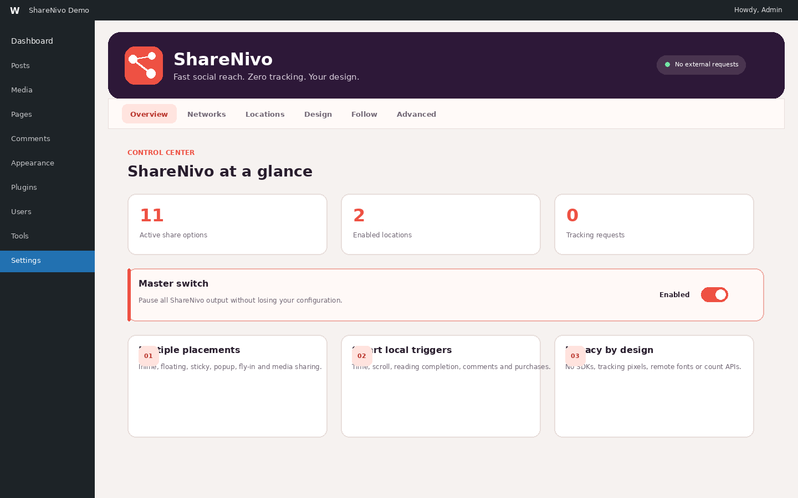
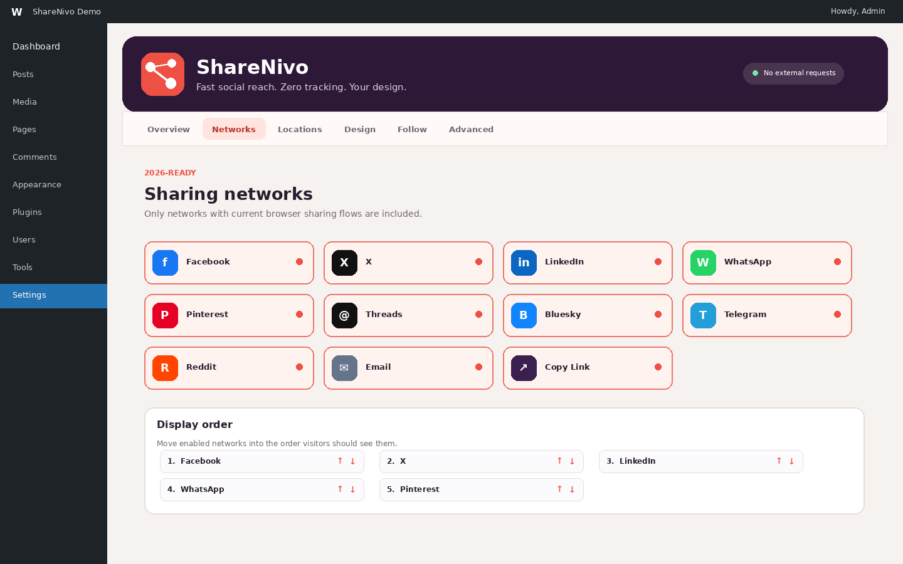
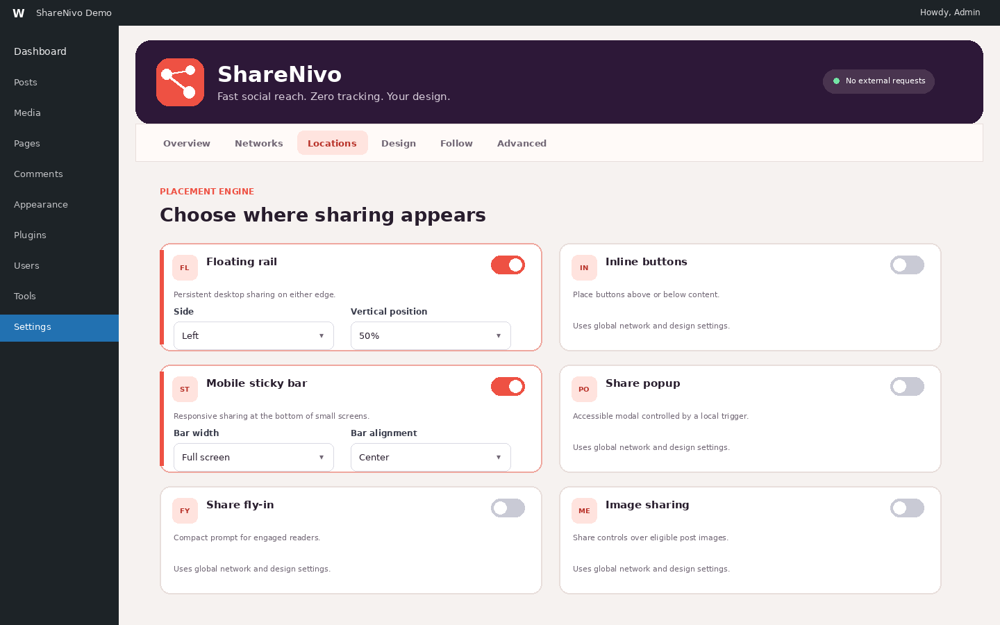
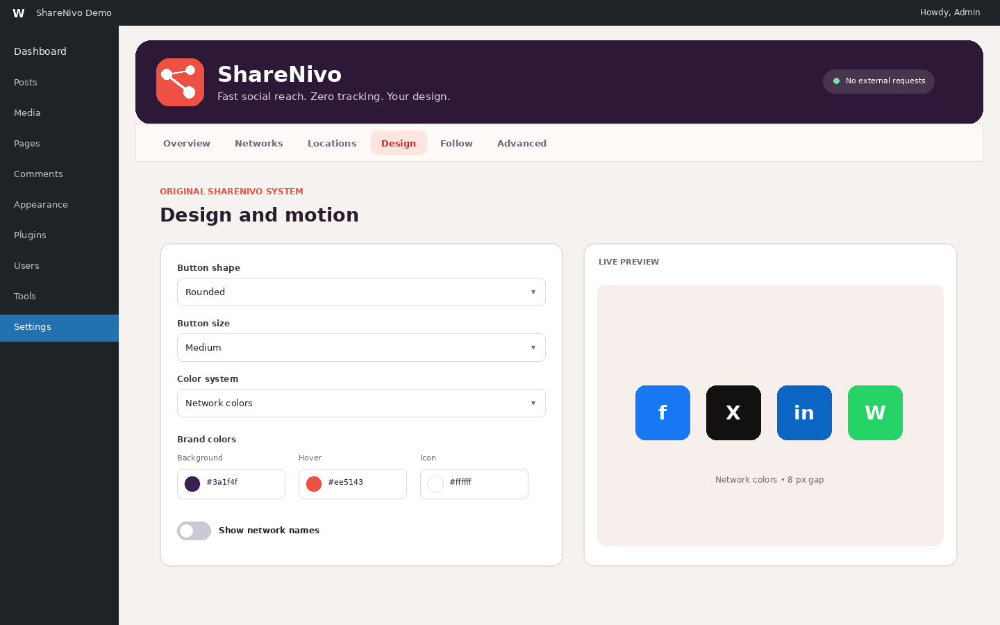
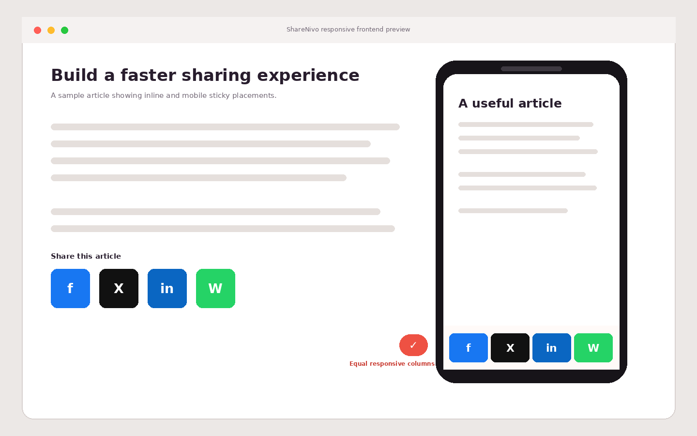

# ShareNivo 2.0 User Guide

ShareNivo adds fast social sharing and follow tools without loading social SDKs, remote fonts, tracking pixels, analytics beacons, or share-count APIs.

## Install ShareNivo

1. In WordPress, open **Plugins → Add New Plugin → Upload Plugin**.
2. Select `sharenivo-fast-social-sharing.zip` and choose **Install Now**.
3. Activate **ShareNivo – Fast Social Sharing**.
4. Open **Settings → ShareNivo**.

## 1. Check the overview



The Overview tab confirms:

- how many sharing options are active;
- how many display locations are enabled;
- that ShareNivo makes zero automatic tracking requests;
- whether the master switch is enabled.

Use the master switch to temporarily hide all ShareNivo output without deleting your configuration.

## 2. Choose and order sharing networks



Open the **Networks** tab and select only the destinations your visitors use. ShareNivo 2.0 includes Facebook, X, LinkedIn, WhatsApp, Pinterest, Threads, Bluesky, Telegram, Reddit, Email, and Copy Link.

Use the up and down controls under **Display order** to define the order shown on the site. Keeping four to six primary networks usually provides a cleaner interface. When the **More** button is enabled, additional networks move into an expandable panel.

## 3. Select display locations



Open **Locations** and enable any combination of:

- **Floating rail:** a persistent desktop rail on the left or right edge;
- **Inline buttons:** above, below, or on both sides of post content;
- **Mobile sticky bar:** fixed to the bottom of screens up to 782 px;
- **Share popup:** an accessible modal shown after a selected local trigger;
- **Share fly-in:** a smaller corner prompt;
- **Image sharing:** controls displayed over eligible post images.

### Configure the mobile sticky bar

The mobile bar has two width modes:

- **Fit buttons:** the bar hugs its buttons and can be aligned left, center, or right. Large sets may scroll within the compact bar.
- **Full screen:** buttons use equal responsive columns. Labeled buttons wrap on narrow screens instead of causing horizontal scrolling.

The alignment control positions **Fit buttons** mode. Full-screen mode always uses the complete available width.

## 4. Customize the design



The **Design** tab controls:

- circle, rounded, square, or pill shapes;
- small, medium, or large buttons;
- network, ShareNivo brand, or minimal color systems;
- brand background, hover, and icon colors;
- network-name labels;
- button gap;
- hover and entrance effects;
- the More button and maximum visible network count.

The live preview updates as settings change. The default ShareNivo palette uses deep plum (`#3a1f4f`) and vivid coral (`#ff5a4f`).

## 5. Verify the frontend



After saving, clear any page cache, CDN cache, and CSS optimization cache before checking the frontend.

Test at these widths:

- 320 px for narrow phones;
- 375–430 px for common phones;
- 768 px for tablets;
- above 782 px for the desktop floating rail.

Full-screen mobile buttons should occupy equal columns without a scrollbar. Compact mode should remain aligned according to its selected position.

## Follow links

Open **Follow**, enable follow tools, enter a heading, and add complete profile URLs. Empty profile fields are not rendered.

Display follow links with one of these methods:

```text
[sharenivo_follow]
```

You can also use the **ShareNivo Follow Links** block, the ShareNivo Follow widget, or the `sharenivo_display_follow` action.

## Manual sharing placement

Insert sharing buttons with:

```text
[sharenivo_share]
```

Choose a supported placement when needed:

```text
[sharenivo_share location="inline"]
[sharenivo_share location="floating"]
[sharenivo_share location="sticky"]
```

The block editor also provides the **ShareNivo Share Buttons** block. Theme developers can render the default manual placement with:

```php
<?php do_action( 'sharenivo_display_buttons' ); ?>
```

## Per-post controls

ShareNivo adds a side-panel meta box to configured public post types. For an individual post or page, choose:

- **Use global settings**;
- **Disable on this content**;
- **Use selected locations**.

Custom mode changes only the active locations for that content. It does not replace the global network or design configuration.

## Popup and fly-in triggers

Popup and fly-in placements can appear after:

- a time delay;
- a scroll percentage;
- reaching the bottom of the content;
- visitor inactivity;
- desktop exit intent;
- returning after a comment;
- a WooCommerce order confirmation.

Frequency can be every page view, once per session, once per day, or once per week. Frequency state is stored in the visitor's browser and does not require a tracking request.

## Import, export, and advanced settings

Open **Advanced** to:

- select public post types;
- allow automatic output on the front page;
- add carefully scoped custom CSS;
- copy a validated JSON configuration;
- import a ShareNivo 2.x JSON configuration.

Always keep a copy of exported JSON before making extensive changes.

## Troubleshooting

### Changes do not appear

Save the settings, then clear WordPress page cache, server cache, optimization/minification cache, and CDN cache. Hard-refresh the browser afterward.

### Mobile sticky bar is missing

The sticky bar appears at screen widths up to 782 px. Confirm that the global master switch and **Locations → Mobile sticky bar** are enabled and that the current post does not disable the location.

### Floating rail is missing on mobile

This is expected when **Hide rail on mobile** is enabled. Use the mobile sticky bar instead.

### Too many buttons appear

Enable the More button and lower **Maximum visible buttons**, or disable lower-priority networks.

### A theme changes button styling

Test with custom CSS disabled first. If the conflict remains, inspect the theme's global button selectors. ShareNivo prefixes its classes with `sharenivo-` to reduce conflicts.

### Share counts are unavailable

ShareNivo 2.0 intentionally removed share counts. Counts require external APIs, caching, and extra requests, and many networks no longer provide reliable public totals.

## Privacy and accessibility

ShareNivo makes no automatic frontend request to a social network. A network is contacted only after a visitor activates its share link. Controls include accessible names, keyboard focus, live copy feedback, dialog semantics, Escape-key handling, and reduced-motion support.

## Uninstall

Deactivation preserves settings. Deleting ShareNivo from the Plugins screen removes its stored options. Export your configuration first if you may reinstall it later.

